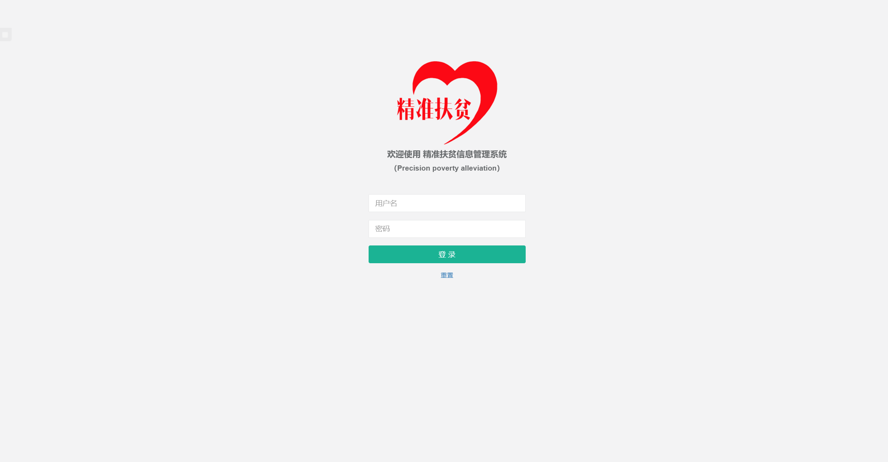
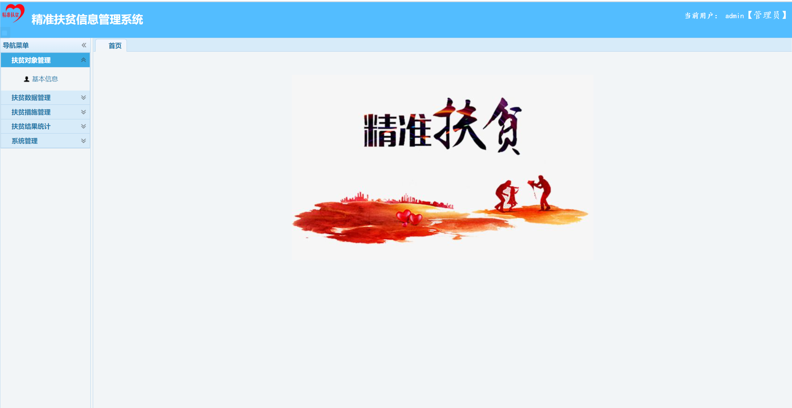
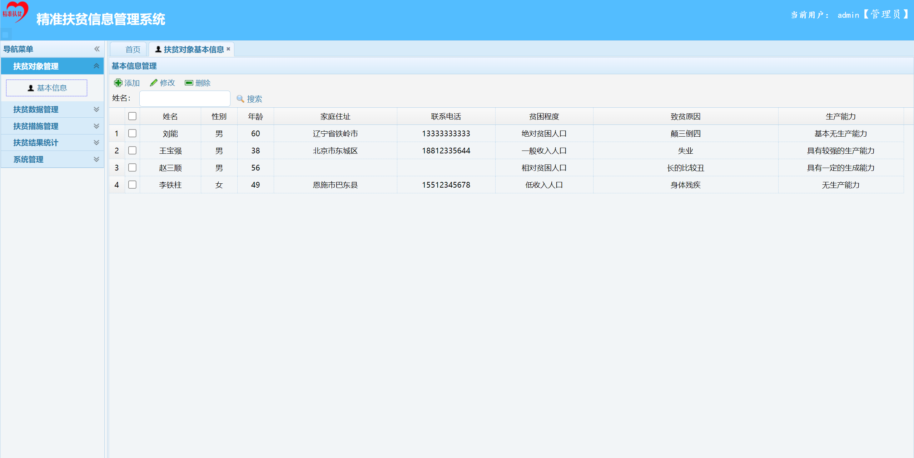
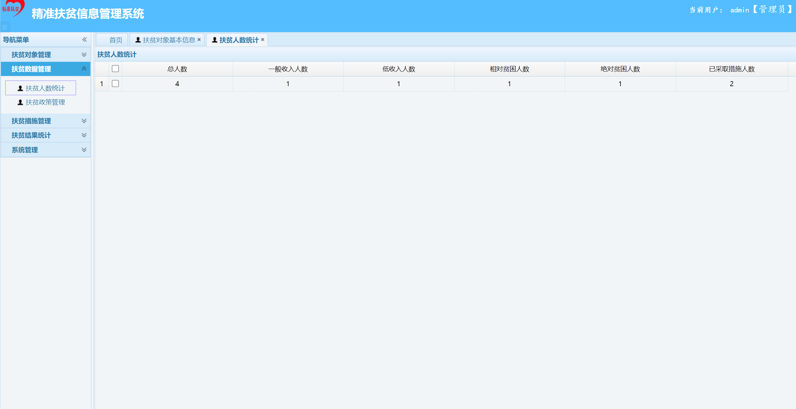
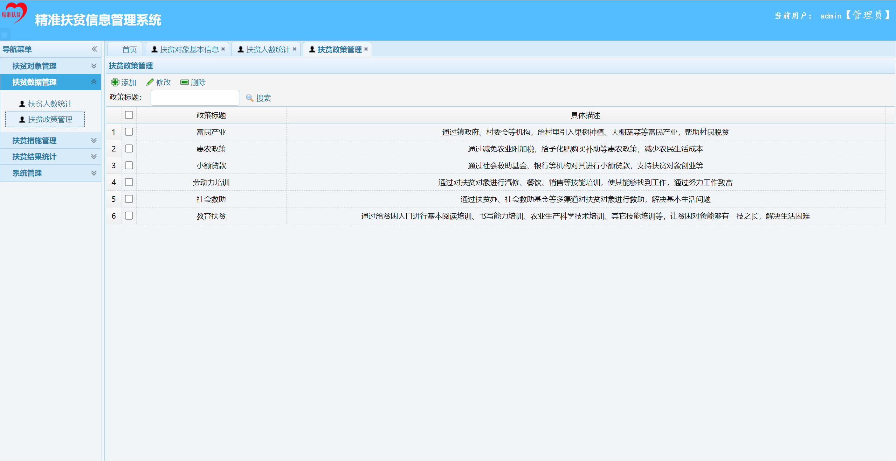
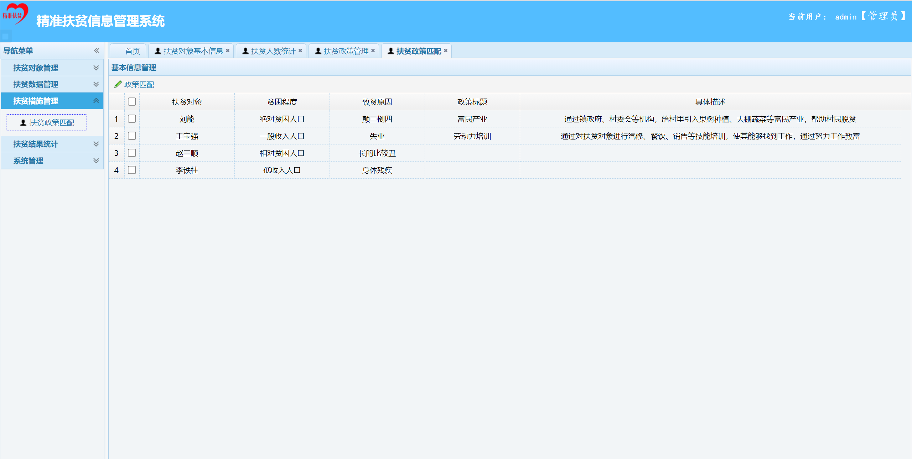
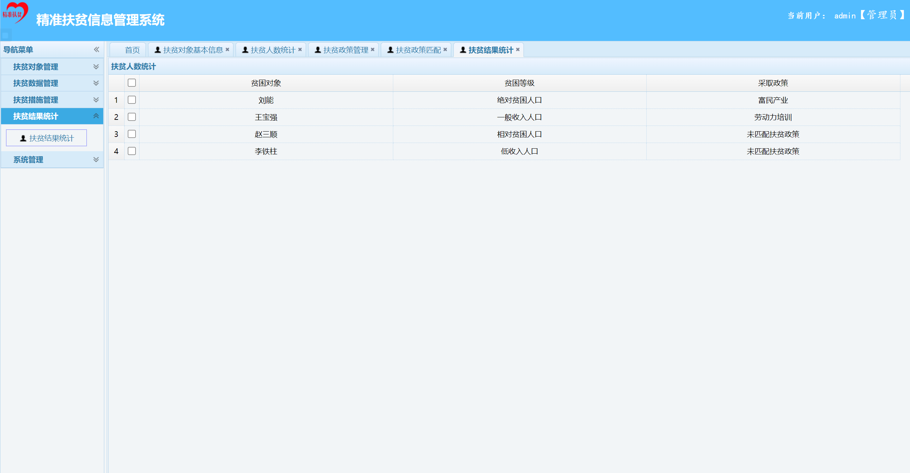
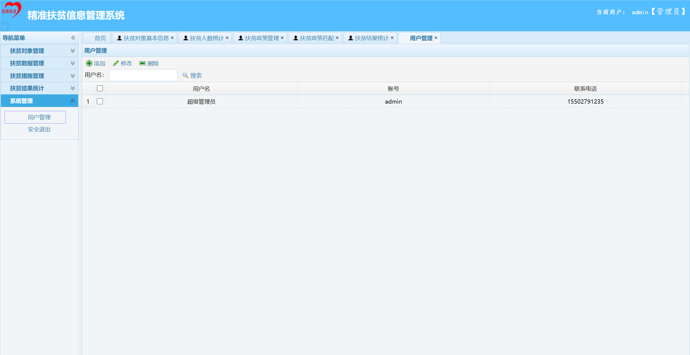

## 基于SSM框架的扶贫信息管理系统

- <b>完整代码获取地址：从戎源码网 ([https://armycodes.com/](https://armycodes.com/))</b>
- <b>技术探讨、资料分享，请加QQ群：692619798</b> 
- <b>作者微信：19941326836  QQ：952045282</b> 
- <b>承接计算机毕业设计、Java毕业设计、Python毕业设计、深度学习、机器学习</b>
- <b>选题+开题报告+任务书+程序定制+安装调试+论文+答辩ppt 一条龙服务</b>
- <b>所有选题地址 ([https://github.com/YuLin-Coder/AllProjectCatalog](https://github.com/YuLin-Coder/AllProjectCatalog)) </b>
## 项目介绍
 基于SSM框架的扶贫信息管理系统, 扶贫作为目前全国的重点工作, 如何使用信息化手段对贫困人员进行跟踪管理是一个急需解决的问题, 该扶贫管理系统主要能够实现扶贫信目标对象的基本信息维护， 包括名称,等级, 另外根据不同的扶贫兑现设置不同的扶贫帮扶政策, 避免的铺大饼而是精细化的进行扶贫，另外系统包括扶贫人人数统计， 扶贫结果统计等功能

实现功能
项目基于ssm框架进行了一个精准扶贫管理系统, 该扶贫管理系统主要包含如下功能
扶贫管理系统登录模块
扶贫对象信息管理模块, 主要对扶贫对象的基本信息包括姓名, 性别, 家庭住址, 贫困程度, 致贫原因等进行录入 修改维护
扶贫措施管理, 方便扶贫人员对目前的扶贫政策进行管理, 并对对应的扶贫对象进行按照原因进行绑定
扶贫数据管理, 主要是对扶贫人数与扶贫政策进行汇总统计

## 项目技术
- 编程语言：Java
- 数据库：MySQL
- 前端技术：JSP、JavaScript、JQuery
- 后端技术：Spring、SpringMVC、MyBatis

## 运行环境
- JDK版本：JDK1.8及以上
- 开发工具：IDEA、Ecplise、Myecplise都可以
- 数据库: MySQL5.7及以上
- Maven：maven3.0及以上

## 运行截图

